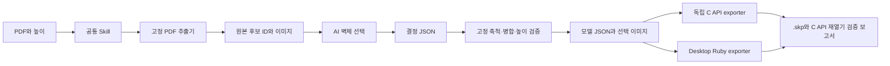

# 아키텍처

제품 목표는 디자이너가 PDF와 벽체 높이만 입력하고 추가 질문 없이 편집 가능한 밑그림 `.skp`를 받는 것이다. 현재 패키지는 그 흐름의 로컬 PoC이며 ChatGPT Pro에 설치하거나 회사에 배포하지 않았다.

AI의 변동이 남는 곳은 평면도 영역·축척 기준점·벽체와 가구 구분이다. 그 결과를 원본 ID와 근거로 기록한다. 같은 결정 입력 이후의 geometry hash는 재현 가능하게 만든다. 회사 공통 Skill만으로 AI 판단까지 항상 동일해지지는 않는다.

패키지를 다른 환경에 가져갈 수 있도록 소스는 `skills/pdf-to-sketchup/scripts` 안에 둔다. 가벼운 Python namespace 모듈로 레이어를 구분한다.

| 경로 | 책임 |
| --- | --- |
| `scripts/main.py` | 실행 진입점 |
| `scripts/app/usecase.py` | CLI 입력, JSON 계약 검증, 실행 조립 |
| `scripts/features/walls/service.py` | 벽체 축척·높이·병합 정책 |
| `scripts/externals/pdf/` | PDF 파싱, 렌더, 선택 이미지 |
| `scripts/features/walls/solid.py` | 모델 입력 검증과 mm 단위 닫힌 입체 구성 |
| `scripts/externals/sketchup/` | C API ABI 연결·native 입출력·재열기 검사와 기존 Ruby exporter |
| `scripts/core/files.py` | JSON 입출력, hash |
| `references/` | 회사 정책 가정, 판단 계약, 평가 절차 |
| `tests/` | PDF 추출부터 모델 입력까지 통합 검증 |

회사 정책은 데이터 파일로 분리하고 app이 feature에 주입한다. 도메인은 PDF·SketchUp 구현을 import하지 않는다. 별도 웹·API·작업 큐·MCP 계층은 이 PoC에 필요하지 않아 만들지 않았다.

로컬 Python 프로세스에서 ctypes로 C API를 호출한다. 사용 가능한 native 바이너리 경로는 실행 인자로 주입한다. feature는 mm 좌표와 면의 vertex index를 생성하며 C API와 inch 변환을 알지 않는다. 외부 adapter는 inch 변환, native 그룹·태그·속성 작성, 파일 저장과 재열기 검사를 담당한다. SDK 호출은 메인 스레드에서 수행한다. 새 `.skp`와 보고서는 임시 경로에서 검증한 뒤 기존 파일을 덮어쓰지 않는 방식으로 게시한다.

이번 PoC는 macOS / C API 14.2에서 설치된 SketchUp 앱의 C API framework를 별도 프로세스에 로드했다. SketchUp Ruby API나 활성 모델을 사용하지 않는다. 독립 SDK 패키지 확보, SDK 바이너리 재배포, 다른 OS 빌드는 별도 검증 대상이다. [결과와 실행 절차](c-sdk-poc.md)를 참고한다. 실제 ChatGPT 계정에서의 실행·파일 전달은 로컬 CLI 성공과 별도로 확인한다.

## 밑그림 모드 0.3.0

기본 `compile`은 `draft_ready`를 출력한다. 의미상 불확실성과 미해결 항목은 보고서에 남기고 native 저장을 계속한다. `--strict`는 기존 검증 모드를 유지한다. 구조적 유효성, 원본/추출 hash, 좌표·높이·솔리드 검증은 두 모드 모두 유지한다.

PDF adapter의 공통 `outlined_paths.py`는 닫힌 직선 stroke 및 실제 평행 선 겹침을 후보로 제공한다. 문틈을 연결하지 않는다. AI는 후보를 선택하고 feature는 추정 벽체를 별도 태그로 분리한다. 도면별 좌표 예외·새 모델링 코드는 추가하지 않는다.

app은 crop한 원본 이미지를 `source-plan.png`로 저장하고 모델 JSON에 상대 경로·hash·실제 크기를 넣는다. native adapter는 이를 `Source_Plan` 그룹의 이미지로 포함한다. 벽체 후보가 0개인 스캔도 참조를 포함한 `.skp`로 출력된다. 이미지 위치·크기·데이터 hash는 저장 전과 재열기 후에 검사한다. 이 이미지까지 geometry hash에 포함하며, 기존 strict 모델의 벽체 hash 형식은 보존한다.

최종 전달 파일은 `.skp`와 `selection.png`다. Skill은 작업별 `work/` 폴더에서 기존 추출·모델 생성·native 저장·검증을 수행하고, 성공한 두 파일만 새 `final/` 폴더로 복사한다. 모델 JSON, 참조 PNG, 검증 보고서는 내부에 유지한다. exporter의 입출력 계약과 검증 코드는 그대로 사용한다.
